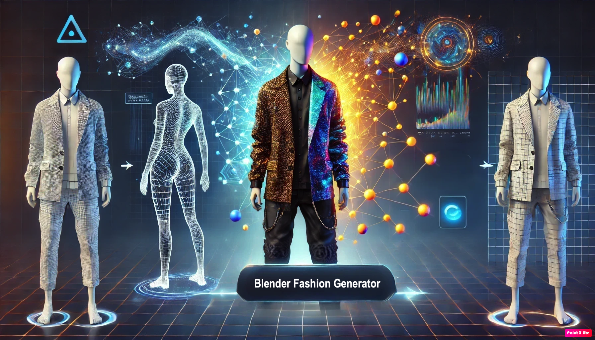

# Blender Fashion Generator

<div align="center">
  
  
  <p>
    
    
    
    
  </p>
</div>

---

## 🎯 Project Objectives

This project aims to explore the potential of **Neural Radiance Fields (NeRFs)** and **3D Gaussian Splatting (3DGS)** techniques for reconstructing three-dimensional scenes from 2D images. The main objectives include:

- **Automated dataset creation**: Structured datasets generated using 3D models from the **DeepFashion3D** dataset via the **BlenderNeRF** add-on.
- Implementation of pipelines capable of rendering photorealistic 3D images from novel viewpoints.
- Training and evaluation of networks based on **NeRF (Nerfacto)** and **3DGS (Splatfacto)** using the **Nerfstudio** framework.
- Assessing network quality using standard metrics such as **PSNR**, **SSIM**, and **LPIPS**, with an emphasis on computational efficiency analysis.

---

## 📊 Dataset

The project uses the **DeepFashion3D** dataset, which contains 3D models of clothing items with detailed textures. This dataset provides a robust foundation for generating images from various angles and under different lighting conditions.

> **Credits**: [DeepFashion3D Dataset](https://github.com/GAP-LAB-CUHK-SZ/deepFashion3D)

---

## 💡 Inspiration

Our project is built upon two main components:

- [BlenderNeRF](https://github.com/maximeraafat/BlenderNeRF)
- [Camera-On-Sphere (COS)](#camera-on-sphere-cos)
- [Train-Test-Camera (TTC)](#train-test-cameras-ttc)

---

## 🛠 Our Approach

### Camera On Sphere (COS)

The **Camera On Sphere (COS)** approach extends the original implementation with the following features:

- **Customizable backgrounds**: Ability to generate images with transparent or white backgrounds.
- **Automated dataset generation**: Automatic splitting into _train_, _validation_, and _test_ sets.
- **Realistic sunlight illumination**: Optimized configurations to ensure realistic lighting effects.
- **Camera position optimization**: Automatic positioning of the camera on the sphere for uniform object coverage.

> **Compatibility**: Direct training with **Instant NGP** or **Nerfacto**.

---

### Train Test Cameras (TTC)

The **Train Test Cameras (TTC)** approach introduces advanced configurations for detailed datasets:

- **Automatic camera setup**: Optimal placement of cameras.
- **360° rotation**: Complete object capture along the Y-axis.
- **Advanced lighting management**: Simulation of realistic lighting scenarios.
- **Structured datasets**: Standardized data organization for seamless model integration.

> **Compatibility**: Requires **COLMAP** for alignment before training with **Instant NGP** or **Nerfacto**.

---

## 🆚 Differences with Instant NGP and Nerfacto

| Approach | Direct Compatibility     | Pre-Processing Required | Background Support   | Realistic Lighting | Structured Dataset |
| -------- | ------------------------ | ----------------------- | -------------------- | ------------------ | ------------------ |
| **COS**  | ✅ Instant NGP, Nerfacto | ✅ No pre-processing    | ✅ Transparent/White | ✅                 | ✅                 |
| **TTC**  | ✅ Instant NGP, Nerfacto | ❌ COLMAP required      | ✅ Transparent/White | ✅                 | ✅                 |

---

## 🛠 Prerequisites

### For COS:

- Install the dependencies required for **Instant NGP** or **Nerfacto**.
- Configure the model parameters to start training directly.

### For TTC:

1. **Install COLMAP**:

   - **Linux**:

   ```bash
    conda install -c conda-forge colmap
   ```

   or:

   ```bash
    sudo apt install colmap
   ```

   - **Windows**:
     - Download the latest version from [COLMAP Releases](https://github.com/colmap/colmap/releases).
     - Extract the files and add the `bin` folder to the system's environment variables.

2. **Generate data with COLMAP**:

   ```bash
   colmap feature_extractor --database_path <path_to_database> --image_path <path_to_images>
   ```

   ```bash
   colmap mapper --database_path <path_to_database> --image_path <path_to_images> --output_path <path_to_output>
   ```

3. **Proceed with training using Instant NGP or Nerfacto.**

---

## 🚀 Getting Started

### Virtual Environment for Blender

1. **Create a virtual environment:**

```bash
python -m venv .venv
```

2. **Activate the virtual environment:**

```bash
source .venv/bin/activate
```

3. **Install the dependencies:**

```bash
pip install -r requirements.txt
```

---

### Configuration in VSCode

1. Install the **Blender Development plugin**.
2. Press Ctrl+Shift+P --> **Blender: Start**.
3. Navigate to **app.py**.
4. Press Ctrl+Shift+P --> **Blender: Run Script**.

---

## Setting Up the Nerfstudio Environment

**1. Create a Conda environment**

```bash
conda init
conda create --name nerfstudio -y python=3.8
conda activate nerfstudio
```

**2. Install dependencies**

```bash
python -m pip install --upgrade pip
cd "C:\Program Files\Microsoft Visual Studio\2022\Community\VC\Auxiliary\Build"
.\vcvarsall.bat x64 -vcvars_ver=14.29
```

**3. Setup CUDA and PyTorch**

```bash
pip uninstall torch torchvision functorch tinycudann
pip install torch==2.1.2+cu118 torchvision==0.16.2+cu118 --extra-index-url https://download.pytorch.org/whl/cu118
conda install -c "nvidia/label/cuda-11.8.0" cuda-toolkit
conda install git
```

**4. Install Nerfstudio**

```bash
pip install git+https://github.com/NVlabs/tiny-cuda-nn/#subdirectory=bindings/torch
pip install nerfstudio
```

---

## 🎓 Model Training

### Basic Training

```bash
ns-train nerfacto --data path/to/data blender-data
```

### Training with Normal Prediction

```bash
ns-train nerfacto --data path/train --pipeline.model.predict-normals True blender-data
```

### Resuming Training from Checkpoint

```bash
ns-train nerfacto --data path/train --pipeline.model.predict-normals True --load-dir path/outputs/train/nerfacto/YYYY-MM-DD/nerfstudio_models blender-data
```

### Model Export

```bash
ns-export format --load-config path_config.yml --output-dir exports
```

---

## 📝 License

This project is released under the **GPL-3.0** license. You can find more details in the [LICENSE](LICENSE) file.

---

## 👥 Authors

This project was collaboratively developed by:

-  [Lorenzo Longarini](https://github.com/LorenzoLongarini)
-  [Alessandro Rongoni](https://github.com/AlessandroRongoni)

Explore our GitHub profiles for more projects and contributions!
