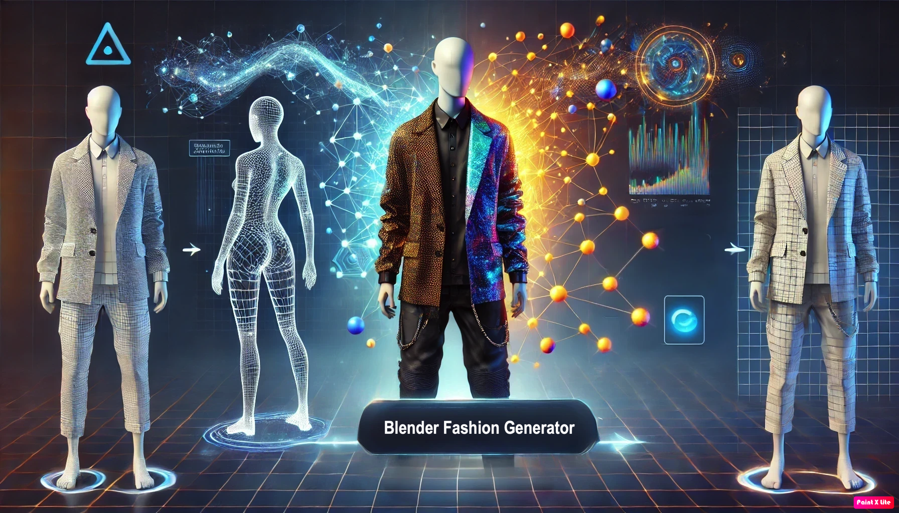
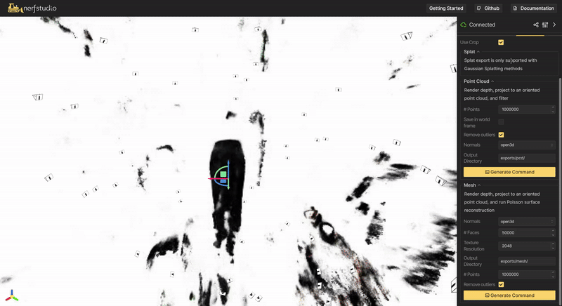

# Blender Fashion Generator

<div align="center">
  
  
  <p>
    
    
    
    
  </p>
</div>

---

## 🎯 Project Objectives

This project aims to explore the potential of **Neural Radiance Fields (NeRFs)** and **3D Gaussian Splatting (3DGS)** techniques for reconstructing three-dimensional scenes from 2D images. The main objectives include:

- **Automated dataset creation**: Structured datasets generated using 3D models from the **DeepFashion3D** dataset via the **BlenderNeRF** add-on.
- Implementation of pipelines capable of rendering photorealistic 3D images from novel viewpoints.
- Training and evaluation of networks based on **NeRF (Nerfacto)** and **3DGS (Splatfacto)** using the **Nerfstudio** framework.
- Assessing network quality using standard metrics such as **PSNR**, **SSIM**, and **LPIPS**, with an emphasis on computational efficiency analysis.

---

## 📊 Dataset

The project uses the **DeepFashion3D** dataset, which contains 3D models of clothing items with detailed textures. This dataset provides a robust foundation for generating images from various angles and under different lighting conditions.

> **Credits**: [DeepFashion3D Dataset](https://github.com/GAP-LAB-CUHK-SZ/deepFashion3D)

---

## 💡 Inspiration

Our project is built upon two main components:

- [BlenderNeRF](https://github.com/maximeraafat/BlenderNeRF)
- [Camera-On-Sphere (COS)](#camera-on-sphere-cos)
- [Train-Test-Camera (TTC)](#train-test-cameras-ttc)

---

## 🛠 Our Approach

### Camera On Sphere (COS)

The **Camera On Sphere (COS)** approach extends the original implementation with the following features:

- **Automated dataset generation**: Automatic splitting into _train_, _validation_, and _test_ sets.
- **Realistic sunlight illumination**: Optimized configurations to ensure realistic lighting effects.
- **Camera position optimization**: Automatic positioning of the camera on the sphere for uniform object coverage.

> **Compatibility**: Direct training with **Instant NGP** or **Nerfacto**.

---

### Train Test Cameras (TTC)

The **Train Test Cameras (TTC)** approach introduces advanced configurations for detailed datasets:

- **Automatic camera setup**: Optimal placement of cameras.
- **360° rotation**: Complete object capture along the Y-axis.
- **Advanced lighting management**: Simulation of realistic lighting scenarios.
- **Structured datasets**: Standardized data organization for seamless model integration.

> **Compatibility**: Requires **COLMAP** for alignment before training with **Instant NGP** or **Nerfacto**.

---

## 🆚 Differences with Instant NGP and Nerfacto

| Approach | Direct Compatibility     | Pre-Processing Required | Background Support | Realistic Lighting | Structured Dataset |
| -------- | ------------------------ | ----------------------- | ------------------ | ------------------ | ------------------ |
| **COS**  | ✅ Instant NGP, Nerfacto | ✅ No pre-processing    | ✅ Transparent     | ✅                 | ✅                 |
| **TTC**  | ✅ Instant NGP, Nerfacto | ❌ COLMAP required      | ✅ Transparent     | ✅                 | ✅                 |

---

## 🛠 Prerequisites

### For COS:

- Install the dependencies required for **Instant NGP** or **Nerfacto**.
- Configure the model parameters to start training directly.

### For TTC:

#### 1. **Install COLMAP**:

- **Linux**:

  ```bash
  conda install -c conda-forge colmap
  ```

  or:

  ```bash
  sudo apt install colmap
  ```

- **Windows**:
  - Download the latest version from [COLMAP Releases](https://github.com/colmap/colmap/releases).
  - Extract the files and add the `bin` folder to the system's environment variables.

---

#### 2. **Using COLMAP**:

We recommend using the **Graphical User Interface (GUI)** version of COLMAP for most users, as it provides a more intuitive and user-friendly experience. Below are instructions for both the **GUI** and **Command Line Interface (CLI)** methods, with a focus on integrating COLMAP with the TTC dataset structure.

---

##### **A. Graphical User Interface (GUI)** (Recommended)

The GUI mode simplifies the process and is ideal for most users. Here’s how to use it:

1. **Open COLMAP**:

   - Launch COLMAP by double-clicking the executable file (on Windows) or running `colmap gui` (on Linux).

2. **Automatic Reconstruction**:

   - Navigate to **"Reconstruction" > "Automatic Reconstruction"**.
   - Select:
     - **Workspace**: The folder containing your TTC dataset.
     - **Image folder**: The folder with the images to process.
   - COLMAP will automatically handle the feature extraction, mapping, and dense reconstruction.

---

##### **B. Command Line Interface (CLI)**

For advanced users, the CLI offers complete control and flexibility for automation. Below is the complete workflow using only the terminal:

1. **Generate Data with COLMAP**:

   - Run the following commands to extract features, create the map, and reconstruct dense models:

     ```bash
     colmap feature_extractor --database_path <path_to_database> --image_path <path_to_images>
     ```

     ```bash
     colmap mapper --database_path <path_to_database> --image_path <path_to_images> --output_path <path_to_output>
     ```

     ```bash
     colmap stereo --workspace_path <path_to_output> --workspace_format COLMAP --Dense_folder DENSE
     ```

     ```bash
     colmap model_converter --input_path <path_to_output>/sparse/0 --output_path <path_to_output>/text --output_type TXT
     ```

---

#### **Processing images**:

- Ensure the generated **Sparse** and **Dense** folders, as well as the **database.db**, are correctly placed in the TTC dataset structure as follows:

```plaintext
  TTC Dataset/
  ├── COLMAP/
  │   ├── SPARSE/
  │   └── DENSE/
  ├── database.db
  └── train/ (folder containing the object photos)
```

Then run the following command:

```bash
ns-process-data images --data {DATA_PATH} --output-dir {PROCESSED_DATA_DIR} --skip-colmap
```

#### **Final Dataset Structure**:

```plaintext
TTC Dataset/
├── COLMAP/
│   ├── SPARSE/
│   └── DENSE/
├── transform.json (generated using the `--skip-colmap` flag)
├── database.db
├── images/ (folders generated by commands with `--skip-colmap`)
├── images_2/
├── images_4/
├── images_8/
└── train/ (folder containing the object photos)
```

> ### **Important Notes**:
>
> - **Dataset Preparation**: Make sure the `COLMAP` directory contains the exported **Sparse** and **Dense** models, as well as the `database.db` generated during the process.
> - **Training Command**: When running the images processing with Nerfstudio, always include the `--skip-colmap` flag to ensure proper integration with the pre-generated COLMAP outputs.

---

#### **Comparison of CLI and GUI**:

| Feature            | CLI                                  | GUI                     |
| ------------------ | ------------------------------------ | ----------------------- |
| **Ease of Use**    | Requires familiarity with commands   | User-friendly interface |
| **Automation**     | Suitable for scripting and pipelines | Manual, interactive     |
| **Flexibility**    | Highly customizable                  | Limited to UI options   |
| **Learning Curve** | Steeper                              | Beginner-friendly       |

Choose the method that best suits your workflow and technical expertise.

---

## 🚀 Getting Started

<!-- ### Virtual Environment for Blender

1. **Create a virtual environment:**

```bash
python -m venv .venv
```

2. **Activate the virtual environment:**

```bash
source .venv/bin/activate
```

3. **Install the dependencies:**

```bash
pip install -r requirements.txt
```

--- -->

### Configuration in VSCode

1. Install the **Blender Development plugin**.
2. Press Ctrl+Shift+P --> **Blender: Start**.
3. Navigate to **app.py**.
4. Press Ctrl+Shift+P --> **Blender: Run Script**.

---

## Setting Up the Nerfstudio Environment

**1. Create a Conda environment**

```bash
conda init
conda create --name nerfstudio -y python=3.8
conda activate nerfstudio
```

**2. Install dependencies**

```bash
python -m pip install --upgrade pip
cd "C:\Program Files\Microsoft Visual Studio\2022\Community\VC\Auxiliary\Build"
.\vcvarsall.bat x64 -vcvars_ver=14.29
```

**3. Setup CUDA and PyTorch**

```bash
pip uninstall torch torchvision functorch tinycudann
pip install torch==2.1.2+cu118 torchvision==0.16.2+cu118 --extra-index-url https://download.pytorch.org/whl/cu118
conda install -c "nvidia/label/cuda-11.8.0" cuda-toolkit
conda install git
```

**4. Install Nerfstudio**

```bash
pip install git+https://github.com/NVlabs/tiny-cuda-nn/#subdirectory=bindings/torch
pip install nerfstudio
```

---

## Configuration Settings

The following table describes the settings from the `config.json` file:

| Key             | Description                                                                                        | Possible Values                              |
| --------------- | -------------------------------------------------------------------------------------------------- | -------------------------------------------- |
| `asset_path`    | Path to the dataset assets.                                                                        | String (e.g., `/assets/DeepFashion/3-1/`)    |
| `ttc`           | Specifies the method used: Train-Test Camera (TTC) or Camera On Sphere (COS).                      | `true` (TTC), `false` (COS)                  |
| `train_name`    | Name of the training dataset. Can be defined by the user.                                          | String (e.g., `3-1`)                         |
| `test_name`     | Name of the test dataset. Can be defined by the user.                                              | String (e.g., `3-1`)                         |
| `aabb`          | Axis-aligned bounding box value for rendering.                                                     | Integer (range: `1-4`, e.g., `2`)            |
| `nerf`          | Specifies if NeRF model is used. If `false`, Instant NGP is used with its specific configurations. | `true`, `false`                              |
| `frames`        | Number of frames to render.                                                                        | Integer (e.g., `200`)                        |
| `focal`         | Focal length of the camera.                                                                        | Float (e.g., `35.0`)                         |
| `sphere_scale`  | Scale of the sphere for rendering. Works only in COS mode.                                         | Array of floats (e.g., `[0.25, 0.25, 0.25]`) |
| `sphere_radius` | Radius of the sphere for rendering. Works only in COS mode.                                        | Integer (e.g., `3`)                          |
| `cam_location`  | Describe the position of the camera. Works only in TTC Mode.                                       | Array of floats (e.g., `[1.5, -1.5, 1.5]`)   |
| `lights`        | Indicates if lights are enabled during rendering.                                                  | `true`, `false`                              |
| `hd`            | Specifies if high-definition rendering is enabled.                                                 | `true`, `false`                              |
| `seed`          | Random seed for reproducibility. Works only in COS mode.                                           | Integer (e.g., `42`)                         |

---

## 🎓 Model Training

### Training with Normal Prediction

#### TTC:

```bash
ns-train nerfacto --data path/train --pipeline.model.predict-normals True
```

#### COS:

```bash
ns-train nerfacto --data path/train --pipeline.model.predict-normals True blender-data
```

### Resuming Training from Checkpoint

#### TTC:

```bash
ns-train nerfacto --data path/train --pipeline.model.predict-normals True --load-dir path/outputs/train/nerfacto/YYYY-MM-DD/nerfstudio_models
```

#### COS:

```bash
ns-train nerfacto --data path/train --pipeline.model.predict-normals True --load-dir path/outputs/train/nerfacto/YYYY-MM-DD/nerfstudio_models blender-data
```

### Model Export

```bash
ns-export format --load-config path_config.yml --output-dir exports
```

If you prefer to crop your object, you can use the export feature from Nerfstudio Viser:


### Model Eval

```bash
ns-eval --load-config=PATH_TO_CONFIG --output-path=output.json
```

---

#### **Evaluation Results**:

The evaluation results for the experiment **`example`** using the method **`nerfacto`** are structured as follows:

```json
{
  "experiment_name": "example",
  "method_name": "nerfacto",
  "checkpoint": "last_checkpoint",
  "results": {
    "psnr": 28.3405,
    "psnr_std": 5.1303,
    "ssim": 0.9411,
    "ssim_std": 0.0367,
    "lpips": 0.055,
    "lpips_std": 0.0504,
    "num_rays_per_sec": 240763.3594,
    "num_rays_per_sec_std": 21055.502,
    "fps": 0.4644,
    "fps_std": 0.0406
  }
}
```

**Explanation of Metrics**:

- **PSNR (Peak Signal-to-Noise Ratio)**: Measures the quality of the reconstructed images. Higher values indicate better quality. **(Key Metric)**
- **SSIM (Structural Similarity Index)**: Evaluates structural similarity between the ground truth and reconstructed images. Closer to 1 means better similarity. **(Key Metric)**
- **LPIPS (Learned Perceptual Image Patch Similarity)**: Assesses perceptual similarity; lower values indicate higher perceptual similarity. **(Key Metric)**
- **Rays Processed per Second**: Measures processing speed in terms of rays handled per second. Higher values indicate better performance.
- **FPS (Frames per Second)**: Reflects rendering speed. Higher values suggest more efficient rendering.

---

---

## 📝 License

This project is released under the **GPL-3.0** license. You can find more details in the [LICENSE](LICENSE) file.

---

## 👥 Authors

This project was collaboratively developed by:

<p align="center">
    <a href="https://github.com/LorenzoLongarini/" style="text-decoration: none;">
        
    </a>
    <a href="https://github.com/AlessandroRongoni/" style="text-decoration: none;">
        
    </a>
</p>

Explore our GitHub profiles for more projects and contributions!
